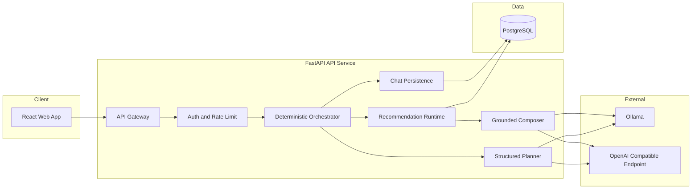
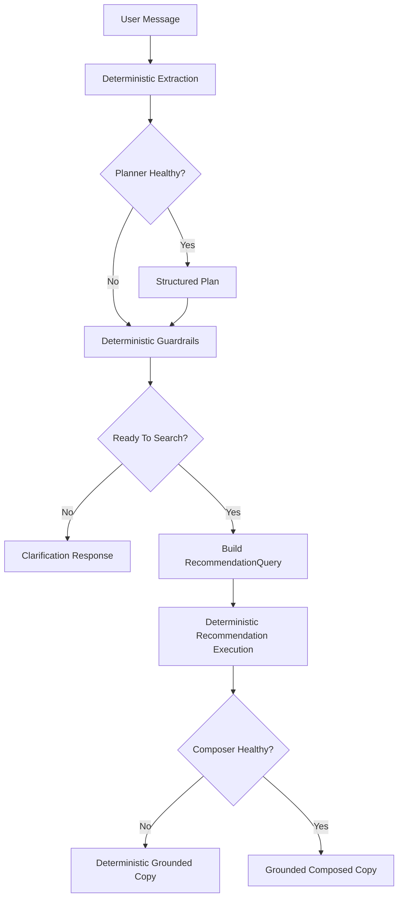

# TravelTom.ai

TravelTom is a full-stack travel planner with a deterministic recommendation
core and an optional LLM-assisted chat layer. The backend owns recommendation
execution, state updates, and safety checks; planner/composer model stages are
bounded helpers, not sources of truth.

## At a Glance

| Area | Current Runtime |
| --- | --- |
| Chat orchestration | Backend-owned, deterministic first |
| Recommendation source | PostgreSQL `catalog_items` |
| LLM usage | Optional structured planner + grounded response composer |
| Local default | `ORCHESTRATOR_LLM_PROVIDER=phi35mini` |
| Deterministic fallback | Always available |
| Auth | TravelTom local bearer auth implemented end to end |

## What This Repo Is

TravelTom delivers a travel-planning chat experience backed by deterministic
retrieval and ranking. Recommendations are grounded in validated backend data,
and the conversation layer is designed to stay correct even when provider-backed
LLM stages are slow, unavailable, or disabled.

## Highlights

- Deterministic recommendations with ranking explanations.
- Backend-owned chat orchestration with strict state validation.
- Optional provider-assisted planning and grounded response composition.
- Local/dev diagnostics for planner/composer usage and degraded-mode fallback.
- First-class documentation in `instructions/`.
- Local-first development with Docker, Alembic, seed data, auth, and smoke tooling.
- Azure deployment scaffolding for Container Apps, PostgreSQL, Key Vault, and App Insights.

## Visual Overview



## Chat Runtime



## Runtime Shape

- `apps/api`: FastAPI backend, chat persistence, recommender runtime, auth, telemetry.
- `apps/web`: React/Vite frontend.
- `traveltom/recommendor`: deterministic ranking and ML ranker experiments.
- `instructions/`: repo source-of-truth docs.
- `scripts/`: seeding, smoke tests, and operational helpers.

## Local Backend Quickstart

1. Create and activate a virtual environment.
2. Install dependencies.
3. Copy `.env.example` to `.env`.
4. Run Postgres and migrations.
5. Seed `catalog_items`.
6. Start the API.

```bash
python -m venv venv
venv\Scripts\activate
pip install -e .
copy .env.example .env
alembic -c apps/api/alembic.ini upgrade head
python scripts/seed_catalog.py --truncate
uvicorn app.main:app --reload --app-dir apps/api
```

`scripts/seed_catalog.py` reads the canonical cleaned snapshot at
`traveltom/datasets/composite/traveltom_clean.csv`. Legacy Parquet artifacts
remain offline-only and are not part of the active seed path.

## Local Chat Modes

- Default local mode: `ORCHESTRATOR_LLM_PROVIDER=phi35mini`
- Ollama mode: `ORCHESTRATOR_LLM_PROVIDER=ollama`
- Deterministic-only mode: `ORCHESTRATOR_LLM_PROVIDER=disabled`
- OpenAI mode: `ORCHESTRATOR_LLM_PROVIDER=openai`

`phi35mini` uses the same local Ollama-compatible structured runtime path as the
existing `ollama` provider, but is configured through `PHI35MINI_*` env vars.

The active recommendation runtime reads from seeded PostgreSQL `catalog_items`.
`RECOMMENDER_DATASET_PATH` is not used by `/api/v1/chat` or
`/api/v1/recommendations/query`; it remains an offline or legacy setting.

## Local Auth And Smoke Flow

If `AUTH_ENABLED=true`, use TravelTom local bearer auth:

```text
POST /api/v1/auth/signup
POST /api/v1/auth/login
Authorization: Bearer <token>
```

The chat smoke runtime script now supports auth-aware checks and validates local
diagnostics headers such as:

- `X-TravelTom-Planner-Status`
- `X-TravelTom-Planner-Used`
- `X-TravelTom-Composer-Status`
- `X-TravelTom-Composer-Used`
- `X-TravelTom-Orchestration-Degraded`
- `X-TravelTom-Fallback-Reason`

`scripts/smoke-chat-runtime.ps1` generates a one-off password when `-Password`
is omitted. Set `TRAVELTOM_SMOKE_PASSWORD` or pass `-Password` explicitly if you
want a stable credential for repeated auth smoke runs.
## Recommender Runtime

- Active API runtime: shared recommendation runtime via
  `apps/api/app/services/recommendation_runtime.py`
- Runtime data source: PostgreSQL `catalog_items`
- Deterministic direct endpoint: `/api/v1/recommendations/query`
- Orchestrator endpoint: `/api/v1/chat`

## Verification

Run the backend test suite:

```bash
venv\Scripts\python.exe -m pytest tests -q
```

Run smoke checks against a running API:

```bash
pwsh ./scripts/smoke-api.ps1 -BaseUrl http://localhost:8000
pwsh ./scripts/smoke-chat-runtime.ps1 -BaseUrl http://localhost:8000 -Provider disabled
pwsh ./scripts/smoke-chat-runtime.ps1 -BaseUrl http://localhost:8000 -Provider ollama -Email smoke@example.com
```

## Repository Layout

- `apps/` runtime services (API + web)
- `infra/` local and cloud infrastructure
- `scripts/` data and tooling
- `tests/` unit and integration tests
- `instructions/` authoritative design and implementation docs
- `traveltom/` recommender and experiment code

## Docs Map

- Start here: `instructions/README.md`
- Backend modules: `instructions/02-backend/`
- Recommender runtime: `instructions/03-recommender/`
- Chat orchestration: `instructions/04-llm-orchestrator/`
- Frontend UX: `instructions/05-frontend/`
- Local dev and ops: `instructions/07-infra-ops/`
- Testing strategy: `instructions/08-quality/testing-strategy.md`
- Azure runtime infra: `infra/azure/README.md`

## Deployment

- Production API container: `apps/api/Dockerfile`
- Production web container: `apps/web/Dockerfile`
- Azure infra modules: `infra/azure/`
- Smoke checks:
  - `pwsh ./scripts/smoke-api.ps1 -BaseUrl https://<api-url>`
  - `pwsh ./scripts/smoke-web.ps1 -BaseUrl https://<web-url>`
  - `pwsh ./scripts/smoke-chat-runtime.ps1 -BaseUrl https://<api-url> -Provider ollama -AccessToken <token>`

## Configuration Rules

- Never hard-code environment-specific values in code.
- Store local settings in `.env` and keep `.env.example` updated.
- Restart the API after changing orchestrator, auth, or provider env vars so
  cached dependencies reload.

## Status

MVP build-out in progress, with backend-owned orchestration and local/dev
diagnostics now aligned with the current runtime.

## License

See `LICENSE`.
