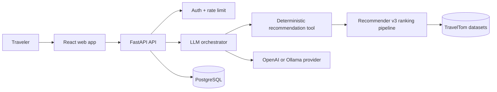
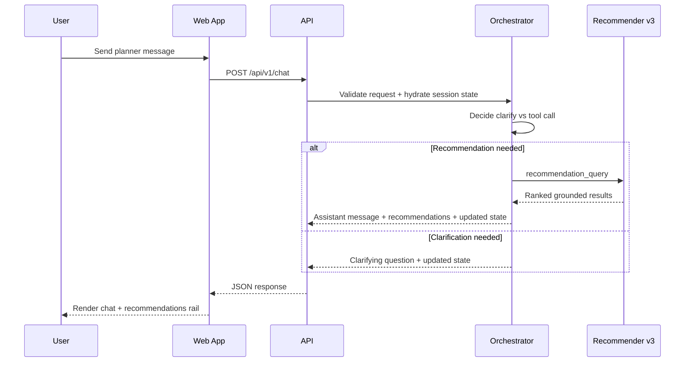
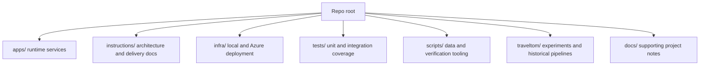

# TravelTom.ai

TravelTom.ai is a full-stack travel planning application that combines a deterministic recommendation pipeline with an LLM orchestration layer. The LLM can decide when to ask follow-up questions or run tools, but the actual recommendation items come from grounded retrieval and ranking code, not model free-form generation.

## Why This Repo Exists

- Demo the product: a planner that can keep trip context, ask for missing details, and return grounded travel recommendations.
- Support contributors: the repo is split into runtime apps, infra, tests, and implementation instructions so the system can be extended without guessing where logic belongs.
- Preserve experimentation safely: production runtime code lives under `apps/`, while older prototypes and data-prep workflows remain under `traveltom/`.

## System At A Glance



TravelTom is intentionally split into two decision layers:

- Conversational orchestration: interprets the user turn, preserves session state, and decides whether to clarify or search.
- Deterministic recommendation execution: retrieves and ranks grounded results using code and data that can be tested independently of the LLM.

## Request Flow



## Repository Map



## Runtime vs Legacy Boundaries

- `apps/` is the runtime surface. If you are changing API behavior, frontend behavior, schemas, routers, or persistence boundaries, start here.
- `traveltom/` contains experiments, data cleaning code, and recommender pipeline code that the runtime still imports in some places. Treat it as legacy-but-important, not as the primary app boundary.
- `instructions/` is the implementation source of truth for architecture, constraints, and delivery standards.
- `docs/` contains supporting notes, investigations, and planning artifacts that are useful but not the main architectural contract.

## Quick Start

### Backend

```bash
python -m venv .venv
.venv\Scripts\activate
pip install -e .[dev]
Copy-Item .env.example .env
alembic -c apps/api/alembic.ini upgrade head
uvicorn app.main:app --reload --app-dir apps/api
```

If you want the legacy local catalog seed path as well:

```bash
python scripts/seed_catalog.py --truncate
```

### Frontend

```bash
cd apps/web
npm install
npm run dev
```

The Vite app proxies `/api/v1/*` to `VITE_API_PROXY_TARGET`, which defaults to `http://localhost:8000` in local development.

### Docker Compose Path

If you want the local full stack with Postgres, migrations, API, and web app:

```bash
docker compose -f infra/docker/docker-compose.yml up --build
```

Add the seed overlay if you want the one-shot catalog seed job before API startup:

```bash
docker compose -f infra/docker/docker-compose.yml -f infra/docker/docker-compose.seed.yml up --build
```

## What Lives Where

| Area | Purpose | Start here |
| --- | --- | --- |
| `apps/api` | FastAPI application, auth, schemas, services, persistence | `apps/api/README.md` |
| `apps/web` | React planner UI, routes, API client, tests | `apps/web/README.md` |
| `infra/docker` | Local compose-based stack | `infra/docker/README.md` |
| `infra/azure` | Azure deployment templates and scripts | `infra/azure/README.md` |
| `scripts` | Seeding, smoke checks, ranker evaluation helpers | `scripts/README.md` |
| `tests` | API, orchestrator, recommender, and script test coverage | `tests/README.md` |
| `traveltom` | Legacy data prep, recommender pipeline, experiments | `traveltom/README.md` |
| `instructions` | Architecture, quality rules, implementation plan | `instructions/README.md` |

## Development Workflows

### Common Commands

Backend:

```bash
python -m pytest tests -q
```

Frontend:

```bash
cd apps/web
npm run test
npm run typecheck
```

Smoke checks:

```bash
pwsh ./scripts/smoke-api.ps1 -BaseUrl http://localhost:8000
pwsh ./scripts/smoke-web.ps1 -BaseUrl http://localhost:5173
```

### Current Runtime Shape

- API entrypoint: `apps/api/app/main.py`
- Route surface: `apps/api/app/api/v1/`
- Shared backend schemas: `apps/api/app/schemas/`
- Orchestrator and chat agent logic: `apps/api/app/services/orchestrator/` and `apps/api/app/services/travel_tom_agent.py`
- Current frontend routes: `/`, `/planner`, `/why-traveltom`, `/how-it-works`, `/login`, `/signup`
- Active deterministic ranker path: `traveltom/recommendor/recommendor_v3.py`

## Documentation Map

Read these in order if you are onboarding to the codebase:

1. `instructions/README.md`
2. `instructions/01-architecture/system-overview.md`
3. `instructions/01-architecture/repo-structure.md`
4. `instructions/09-implementation-plan/implementation-plan.md`

Use these focused entrypoints by task:

- Backend/API work: `instructions/02-backend/`
- Recommender work: `instructions/03-recommender/`
- LLM orchestration work: `instructions/04-llm-orchestrator/`
- Frontend work: `instructions/05-frontend/`
- Infra and runbooks: `instructions/07-infra-ops/`
- Ticket authoring: `instructions/08-quality/agent-ticket-template.md`

Supporting docs live here:

- `docs/README.md`
- `examples/README.md`
- `infra/azure/README.md`
- `infra/docker/README.md`

## Documentation Conventions

- Use local `README.md` files for orientation, ownership, entrypoints, and common commands.
- Use `instructions/` for architecture rules, implementation guidance, and project standards.
- Prefer Mermaid diagrams over external screenshots for system visuals.
- Keep runtime docs aligned with the real code layout. If behavior changes, update docs in the same change.

## Status

The project is in active MVP build-out. The repository already has production-shaped boundaries, but several areas still preserve prototype lineage and active design iteration.

## License

See `LICENSE`.
