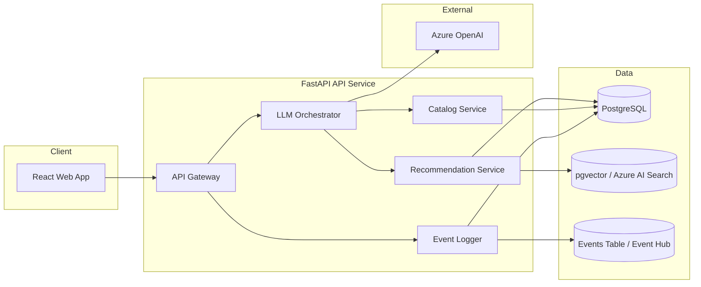

# System Overview

## High-level architecture

## Service boundaries

- Frontend (React): Chat UI, recommendation lists, shortlist manager, itinerary view, booking stub.
- Backend (FastAPI): API gateway, orchestration, deterministic recommendation, catalog access, event logging.
- Backend persistence boundaries: feature-scoped repositories and unit-of-work transactions (chat implemented first).
- Recommendation Service: Deterministic retrieval + ranking. Implemented as an internal module in the API service.
- LLM Orchestrator: Tool-first routing and response generation. It does not create recommendations.
- Data: PostgreSQL for operational data; pgvector (MVP and fallback) and Azure AI Search (final primary) via abstraction.

## Runtime vs experimentation

- `apps/`: production runtime services (API and web).
- `traveltom/`: experimentation and prototypes. Do not refactor into runtime.

## Data flow summary

1. User sends a message via frontend.
2. Backend validates request and persists session state via feature-scoped repository + unit-of-work boundaries.
3. Orchestrator selects tools to call (catalog lookup, recommendation retrieval, ranking).
4. Recommendation Service returns deterministic ranked results.
5. Orchestrator composes response with explanations derived from ranker features.
6. Frontend renders results and logs events.

## Recommendation types

- Destinations
- Hotels
- Flights
